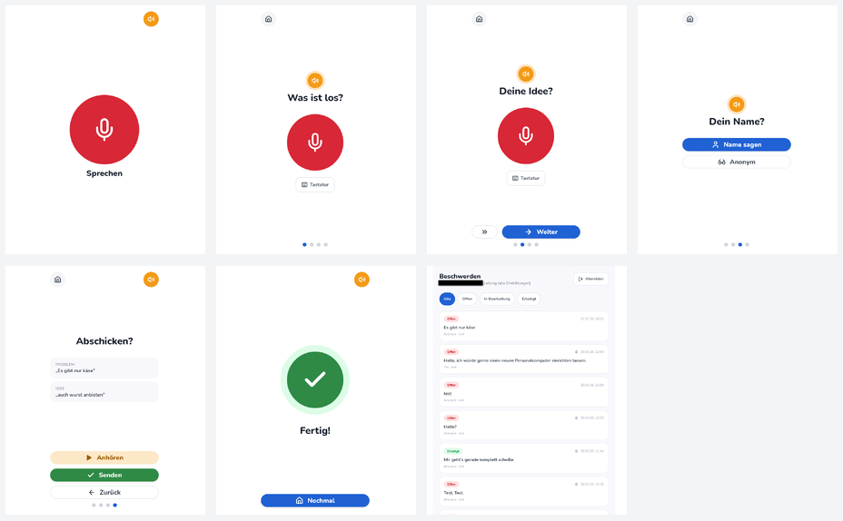
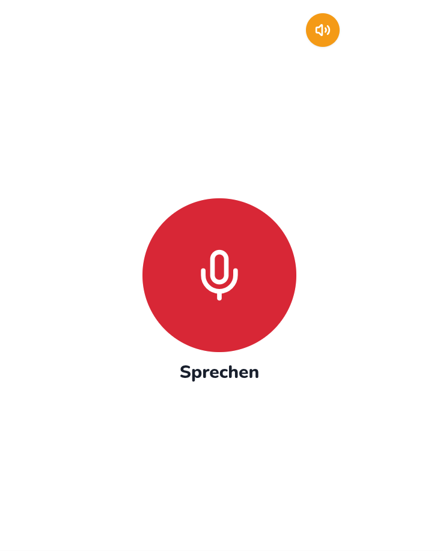
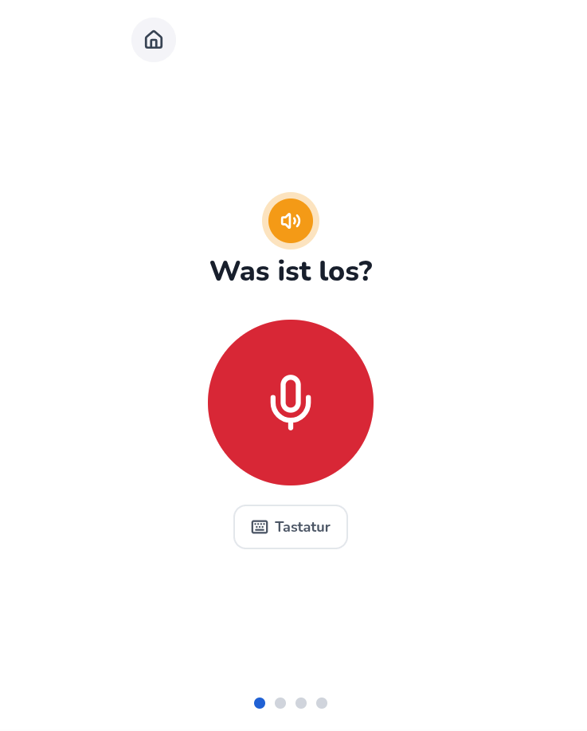
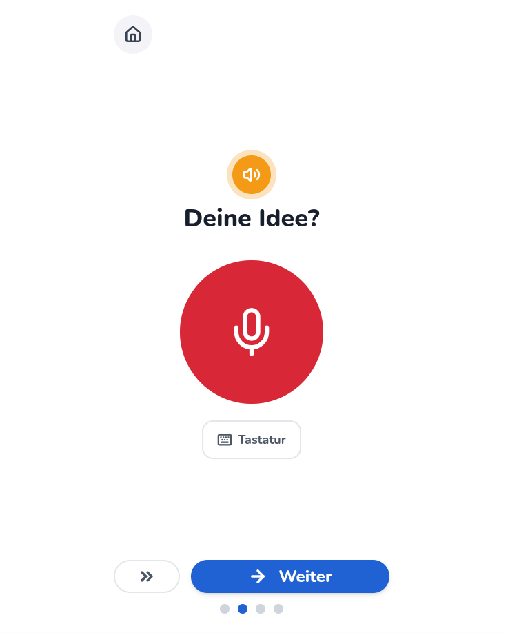
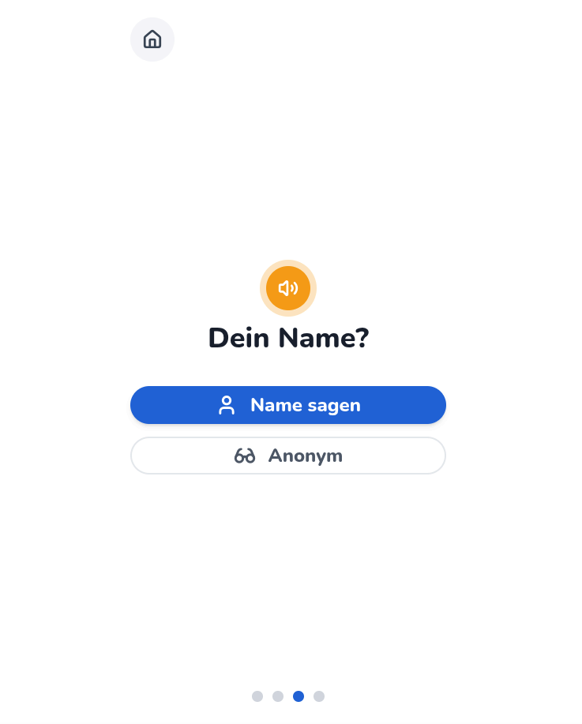
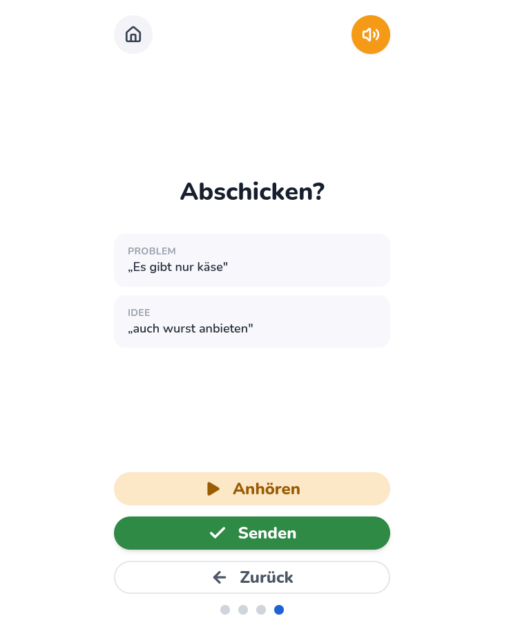
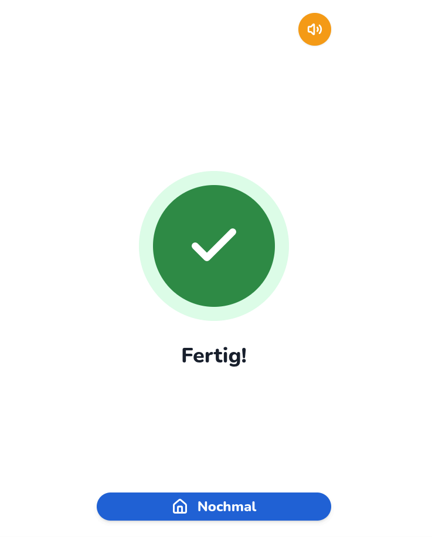
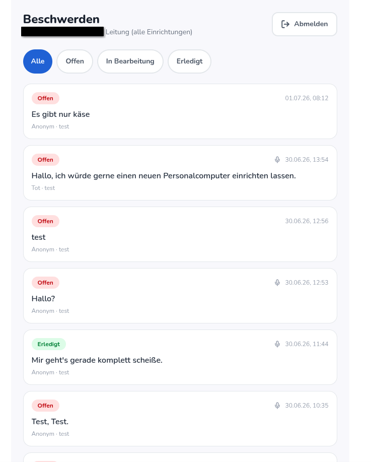

# Meine Stimme

> Barrierefreie, sprachbasierte Beschwerde-App für Menschen mit geistiger Behinderung in Besonderen Wohnformen.

Bewohner:innen sprechen ihr Anliegen auf ein Kiosk-Tablet ein — die App liest jede Frage vor,
transkribiert die Antwort per KI direkt im Browser und schickt Beschwerde, Text **und** Audioaufnahme
per E-Mail an die zentrale Stelle der Einrichtung. Die Verwaltung pflegt Bearbeitungsstatus und
hört Aufnahmen rollenbasiert an.



---

## Inhaltsverzeichnis

1. [Hintergrund & Ziel](#1-hintergrund--ziel)
2. [Screenshots](#2-screenshots)
3. [Technologie-Stack](#3-technologie-stack)
4. [Architektur](#4-architektur)
5. [Projektstruktur](#5-projektstruktur)
6. [Routen](#6-routen)
7. [Voraussetzungen](#7-voraussetzungen)
8. [Lokale Entwicklung](#8-lokale-entwicklung)
9. [Deployment (Vercel)](#9-deployment-vercel)
10. [Sicherheit & Datenschutz](#10-sicherheit--datenschutz)
11. [Entwicklungsskripte](#11-entwicklungsskripte)
12. [Team & Kontext](#12-team--kontext)

---

## 1. Hintergrund & Ziel

Menschen mit geistiger Behinderung in Besonderen Wohnformen haben ein gesetzlich verankertes Recht
auf niederschwellige Beschwerde (§§ 7, 8 BTHG). Der bisherige Papierbogen setzt Lesen und Schreiben
voraus — und muss einer betreuenden Person persönlich übergeben werden, gegen die sich die Beschwerde
richten kann.

**Meine Stimme** löst beides:

- Sprache statt Schrift — große Knöpfe, Vorlesen, ein Klick zum Aufnehmen.
- Kein Mittelsmann — das Anliegen erreicht die Leitung direkt, anonym wenn gewünscht.
- Barrierefreiheit nach Vorbild *Mebis* (große Schaltflächen, Touch, Vorlese-Funktion).

---

## 2. Screenshots

### Bewohner-Flow

| Start | Problem | Lösung |
| :---: | :---: | :---: |
|  |  |  |

| Name | Bestätigen | Fertig |
| :---: | :---: | :---: |
|  |  |  |

### Verwaltungs-Ansicht (Admin)

| Beschwerde-Liste & Detail |
| :---: |
|  |

---

## 3. Technologie-Stack

| Bereich | Technologie |
| :--- | :--- |
| **Frontend** | React 19, TypeScript, Vite, Tailwind CSS v4, Zustand |
| **Routing** | React Router v7 (`/:facilitySlug/*`) |
| **Icons** | lucide-react |
| **KI — Spracherkennung** | Whisper (`Xenova/whisper-base`) via Transformers.js — läuft lokal im Browser |
| **Audioaufnahme** | MediaRecorder-API (WebM/Opus) |
| **Vorlesen** | Web Speech API (`SpeechSynthesis`, de-DE) + vorproduzierte WAV-Voicelines |
| **Backend** | Vercel Serverless Functions (Node.js, ESM) |
| **Datenbank + Auth** | Supabase (PostgreSQL + Row-Level-Security, Region Frankfurt) |
| **Audio-Speicher** | Supabase Storage (privater Bucket) |
| **E-Mail** | Resend (Audio als Anhang) |
| **Hosting** | Vercel (Auto-Deploy via GitHub) |

---

## 4. Architektur

```
Bewohner-Tablet  (Kiosk-Browser, Einrichtungs-Slug in der Start-URL)
   │
   │  Vorlesen (WAV-Voicelines + SpeechSynthesis-Fallback)
   │  Aufnahme (MediaRecorder → WebM/Opus-Blob)
   │  KI: Whisper im Browser  →  transkribierter Text
   ▼
Vercel Serverless Function  POST /api/complaints
   ├──▶ Supabase Storage     complaint-audio/{slug}/{id}/problem.webm …
   ├──▶ Supabase PostgreSQL  INSERT INTO complaints …
   └──▶ Resend               E-Mail mit Text + Audio-Anhang an zentrale Adresse

Verwaltungs-Ansicht  /admin  (React, Supabase Auth)
   ├── GET  complaints  (RLS: nur eigene Einrichtung)
   ├── PATCH /api/complaints/:id  (Status ändern, Auth-geprüft)
   └── GET  /api/audio-url        (signierte URL, Anonym-Sperre)
```

**Kiosk-Identität:** Der Einrichtungs-Slug kommt ausschließlich aus `window.location.pathname`
(z. B. `/wohnform-03`) — frisch bei jedem Laden, kein Cookie, kein Login nötig.

**Hintergrund-Transkription:** Die KI läuft während der Nutzer schon zur nächsten Seite klickt.
Beim Absenden wartet die App auf noch laufende Erkennungen, bevor sie sendet.

---

## 5. Projektstruktur

```
Meine_Stimme/
├── api/                          # Vercel Serverless Functions
│   ├── complaints.ts             # POST: Beschwerde einreichen (Multipart, Audio, Mail)
│   ├── complaints/[id].ts        # PATCH: Status ändern (Admin, JWT-geprüft)
│   ├── audio-url.ts              # GET: signierte Audio-URL (Admin, Anonym-Sperre)
│   └── _lib/
│       ├── supabaseAdmin.ts      # Supabase Service-Role-Client (server-only)
│       ├── resend.ts             # Resend-E-Mail-Client
│       └── facilityConfig.ts    # Slug → Einrichtungsname
├── frontend/
│   └── src/
│       ├── screens/              # 6 Bewohner-Screens + DoneScreen
│       │   ├── StartScreen.tsx
│       │   ├── ProblemScreen.tsx
│       │   ├── SolutionScreen.tsx
│       │   ├── NameScreen.tsx
│       │   ├── ConfirmScreen.tsx
│       │   └── DoneScreen.tsx
│       ├── components/           # BigButton, KioskFrame, RecordControls, ReadAloudButton …
│       ├── lib/
│       │   ├── facility.ts       # Slug aus URL lesen
│       │   ├── transcriber.ts    # Whisper-Singleton (lazy-loaded)
│       │   ├── audioPlayback.ts  # globaler Playback-Controller
│       │   ├── voicelines.ts     # Pfade zu WAV-Voicelines
│       │   └── submitComplaint.ts
│       ├── state/
│       │   └── complaintStore.ts # Zustand-Store (Blobs, Texte, Transkriptions-Status)
│       └── admin/
│           ├── AdminApp.tsx
│           ├── LoginScreen.tsx
│           ├── ComplaintList.tsx
│           └── ComplaintDetail.tsx
├── supabase/
│   └── migrations/0001_init.sql  # Schema, RLS-Policies, Storage-Bucket
├── docs/
│   ├── Kurzdokumentation.md
│   ├── Fortschritt.md
│   └── ui/                       # Echte App-Screenshots
├── .env.example
├── vercel.json
└── package.json                  # npm workspaces (Root + frontend)
```

---

## 6. Routen

| Pfad | Screen |
| :--- | :--- |
| `/:facilitySlug` | Startseite |
| `/:facilitySlug/problem` | Problem schildern |
| `/:facilitySlug/loesung` | Lösungsvorschlag (optional) |
| `/:facilitySlug/name` | Name oder anonym |
| `/:facilitySlug/bestaetigen` | Zusammenfassung & Absenden |
| `/:facilitySlug/fertig` | Bestätigung |
| `/admin` | Admin-Login |
| `/admin/complaint/:id` | Beschwerde-Detail (Audio + Status) |

---

## 7. Voraussetzungen

- **Node.js** 20+, **npm** 10+
- [Supabase-Konto](https://supabase.com) (kostenlos)
- [Resend-Konto](https://resend.com) (kostenlos)
- [Vercel-Konto](https://vercel.com) (kostenlos)

---

## 8. Lokale Entwicklung

### Repository klonen

```bash
git clone https://github.com/Monstroxx/Meine_Stimme.git
cd Meine_Stimme
npm install
```

### Supabase-Projekt anlegen

1. [Supabase Dashboard](https://supabase.com/dashboard) → **New project**, Region **Frankfurt**
2. Unter **Project Settings → API** notieren:
   - `Project URL` → `SUPABASE_URL`
   - `anon public` → `VITE_SUPABASE_PUBLISHABLE_KEY`
   - `service_role secret` → `SUPABASE_SECRET_KEY`
3. **SQL Editor** öffnen → Inhalt von [`supabase/migrations/0001_init.sql`](supabase/migrations/0001_init.sql) einfügen und ausführen
   (erstellt Tabellen, RLS-Policies und den privaten Bucket `complaint-audio`)

### Resend einrichten

1. [Resend Dashboard](https://resend.com) → **API Keys** → neuen Key anlegen → `RESEND_API_KEY`
2. Optional: eigene Domain verifizieren (`RESEND_FROM`). Ohne Domain wird `onboarding@resend.dev` genutzt
   (sendet nur an die E-Mail-Adresse des Resend-Accounts).

### Umgebungsvariablen

```bash
cp .env.example .env
```

`.env` (Root, für die Serverless Functions):

| Variable | Beschreibung |
| :--- | :--- |
| `SUPABASE_URL` | Supabase Project URL |
| `SUPABASE_SECRET_KEY` | Service-Role-Key — **niemals ins Frontend** |
| `RESEND_API_KEY` | Resend API-Key |
| `COMPLAINT_RECIPIENT_EMAIL` | Zentrale Empfängeradresse für Beschwerden |
| `RESEND_FROM` | Absenderadresse (optional) |

`frontend/.env.local` (für Vite):

```env
VITE_SUPABASE_URL=<gleiche URL>
VITE_SUPABASE_PUBLISHABLE_KEY=<anon public key>
```

### Lokal starten

```bash
npm run dev        # Vite-Dev-Server (Frontend) — http://localhost:5173
npm run dev:api    # Lokaler API-Server (Serverless Functions) — http://localhost:3000
```

Im Browser aufrufen: `http://localhost:5173/wohnform-01`

### Admin-Account anlegen

1. Supabase Dashboard → **Authentication → Users → Add User**
2. E-Mail und Passwort vergeben
3. Im **SQL Editor** eine Staff-Zeile anlegen:

```sql
INSERT INTO staff (user_id, facility_slug, role)
VALUES (
  '<UUID des neuen Users>',
  null,         -- null = Leitung (sieht alle Einrichtungen)
  'leitung'
);
```

Admin-Ansicht: `http://localhost:5173/admin`

---

## 9. Deployment (Vercel)

1. Repository in Vercel importieren (GitHub)
2. **Environment Variables** in den Projekt-Einstellungen setzen:
   ```
   SUPABASE_URL
   SUPABASE_SECRET_KEY
   RESEND_API_KEY
   COMPLAINT_RECIPIENT_EMAIL
   VITE_SUPABASE_URL
   VITE_SUPABASE_PUBLISHABLE_KEY
   ```
3. Deploy auslösen — `vercel.json` regelt SPA-Rewrites und API-Routing automatisch.

Kiosk-Start-URL: `https://<projekt>.vercel.app/wohnform-01`

---

## 10. Sicherheit & Datenschutz

| Maßnahme | Umsetzung |
| :--- | :--- |
| **Verschlüsselung Übertragung** | HTTPS/TLS automatisch via Vercel & Supabase |
| **Verschlüsselung Ruhezustand** | Supabase-Standard (verschlüsselte Festplatten) |
| **Passwort-Hashing** | Supabase Auth (bcrypt intern) |
| **Row-Level-Security** | Anon nur INSERT; Personal nur eigene Einrichtung; kein DELETE |
| **API-Schlüssel & Empfängeradresse** | Nur in Env-Vars, nie im Frontend-Bundle |
| **Server-seitige Validierung** | Pflichtfeld- und Slug-Prüfung im Backend |
| **Privater Audio-Storage** | Kein Public-Zugriff; nur kurzlebige signierte URLs |
| **Datenminimierung** | Keine IP-Adressen oder Geräte-Kennungen gespeichert |
| **Anonyme Aufnahmen (Ethik)** | Stimme erkennbar → Audio nur für `leitung`-Rolle zugänglich |
| **Whisper läuft lokal** | Audiodaten verlassen das Gerät für die KI-Erkennung nicht |
| **EU-Hosting** | Supabase Frankfurt, Resend EU-Region |

**Löschkonzept:** Beschwerden und Audiodateien werden nach Abschluss für max. 12 Monate aufbewahrt,
anonyme Aufnahmen direkt nach Bearbeitung. (Im Prototyp als Konzept; kein automatisierter Löschjob.)

---

## 11. Entwicklungsskripte

```bash
npm run dev        # Vite-Dev-Server (Port 5173)
npm run dev:api    # API-Dev-Server (Port 3000)
npm run build      # Production-Build des Frontends
npm run lint       # Linting (oxlint)
```

---

## 12. Team & Kontext

Entwickelt im Rahmen der **Praktikumsersatzleistung HIT12 „AWE mit KI"** (Projektwoche 29.06.–03.07.2026).

**Team:** [Monstroxx](https://github.com/Monstroxx) · TagerTi

**Live-Demo:** https://meine-stimme-frontend-monstroxxs-projects.vercel.app/wohnform-01

**KI-Einsatz:**
- **Whisper** (OpenAI-Modell via Transformers.js) — Spracherkennung direkt im Browser
- **Claude (Anthropic)** — KI-Assistent bei Architektur, Code und Dokumentation
