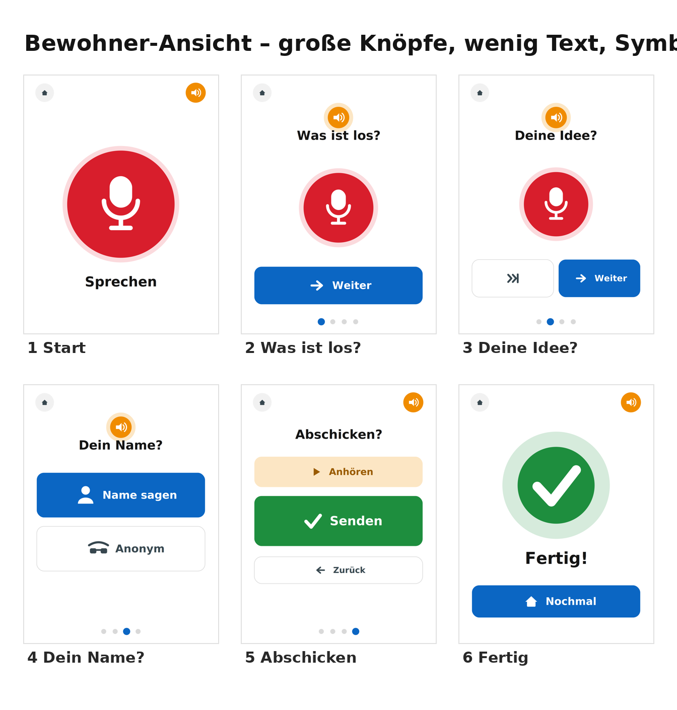
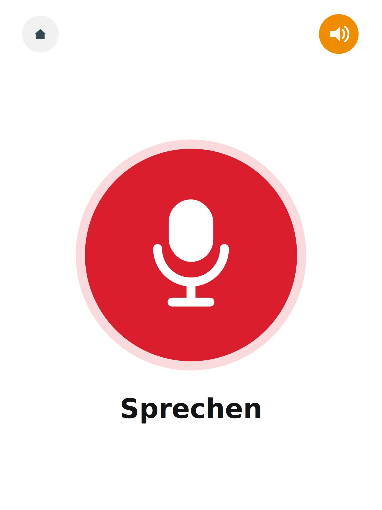
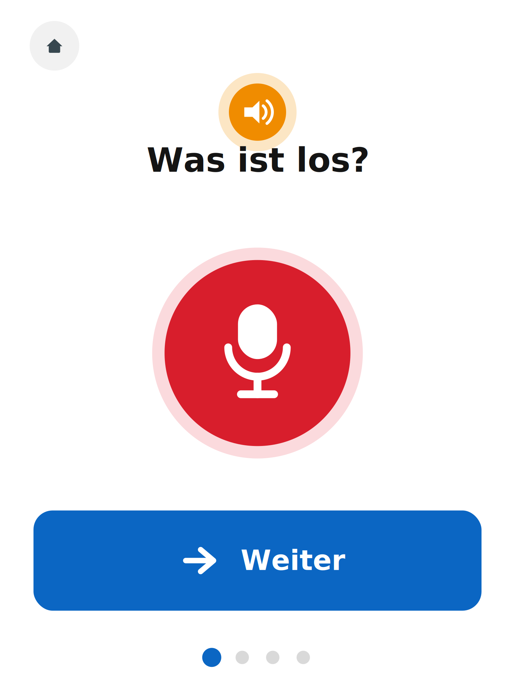
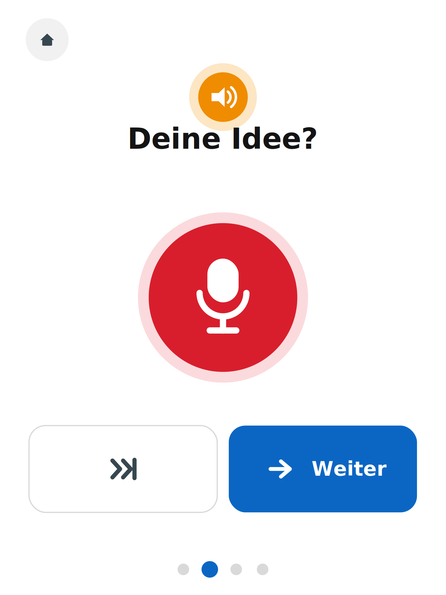
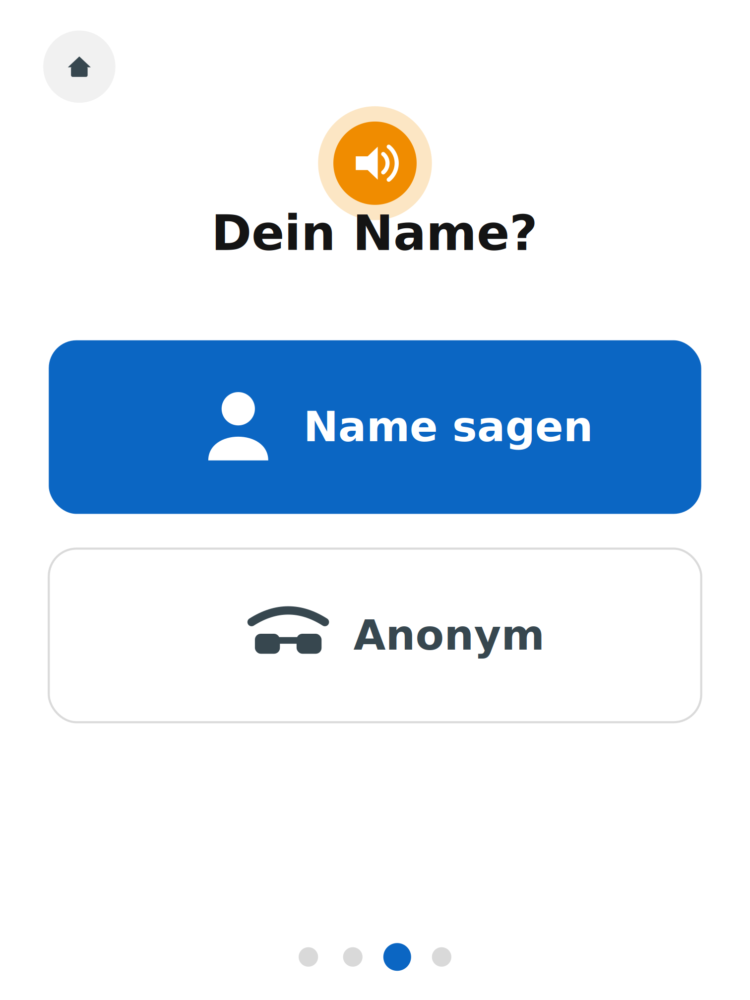
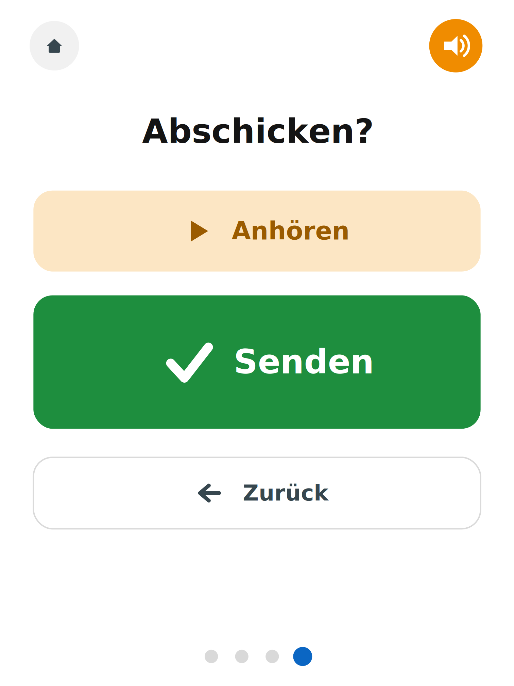
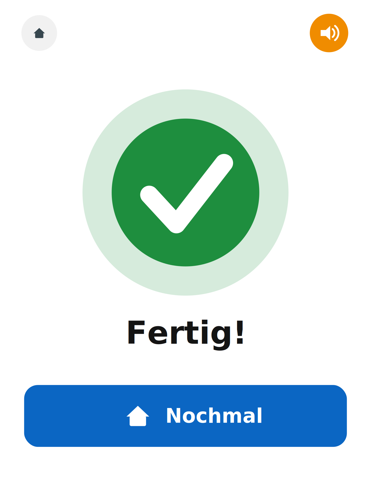
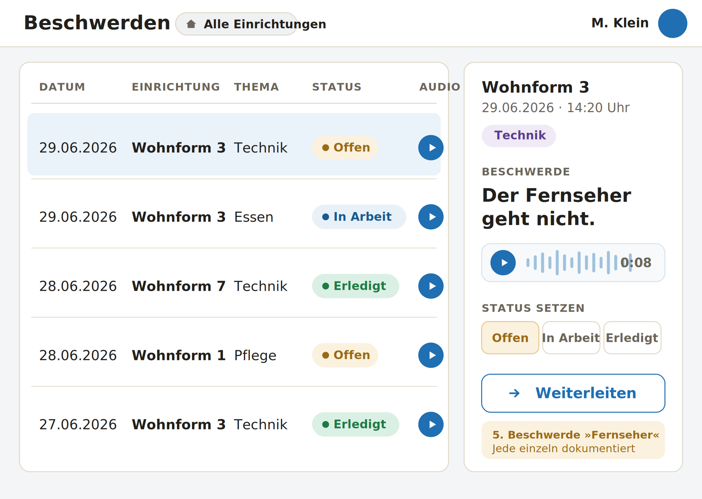

# Meine Stimme — Kurzdokumentation

**HIT12 · Praktikumsersatzleistung „AWE mit KI" · Projektwoche 29.06.–03.07.2026**

Eine barrierefreie, sprachbasierte Beschwerde-App für Menschen mit geistiger
Behinderung in Besonderen Wohnformen.

---

## 1. Idee

**Meine Stimme** ist eine digitale, barrierefreie Beschwerdemöglichkeit für Menschen
mit geistiger Behinderung. Statt einen Papierbogen auszufüllen, sprechen die
Bewohner:innen ihr Anliegen einfach auf ein Tablet. Die App liest jede Frage vor,
nimmt die Antwort als Sprache auf, wandelt sie per KI in Text um und schickt
Beschwerde, Text **und** Audioaufnahme an eine zentrale Stelle der Einrichtung —
zusätzlich landet jede Beschwerde in einer Verwaltungs-Ansicht, in der die Leitung
den Bearbeitungsstand pflegt.

Der Ablauf ist bewusst auf das Nötigste reduziert: **eine Frage pro Bildschirm**,
große Knöpfe, echte Symbole, Vorlesefunktion. Vorbild für die Bedienung ist das
barrierefreie Lernsystem *Mebis* (große Schaltflächen, Touch-Bedienung,
Vorlese-Funktion, METACOM-Symbole).

## 2. Gesellschaftlicher Nutzen

Menschen mit geistiger Behinderung leben in Besonderen Wohnformen in einem starken
**Abhängigkeits- und Machtgefälle** gegenüber den Assistent:innen, die sie rund um
die Uhr betreuen. Sich zu beschweren ist für sie doppelt schwer:

- **Sprach- und Schreibbarrieren** — der bisherige Papierbogen „Besser werden" setzt
  Lesen und Schreiben voraus, was viele Bewohner:innen ausschließt.
- **Soziale Hürde** — eine Beschwerde muss bisher einer betreuenden Person persönlich
  übergeben werden, obwohl sie sich genau gegen diese Person richten kann
  (**Gewaltschutz**).

Meine Stimme stärkt damit drei gesellschaftlich zentrale Werte:

1. **Selbstbestimmung & Teilhabe** — Betroffene äußern ihr Anliegen selbstständig,
   ohne fremde Hilfe.
2. **Inklusion & Barrierefreiheit** — Sprache statt Schrift, Vorlesen statt Lesen.
3. **Gewaltschutz** — eine anonyme, niederschwellige Meldemöglichkeit, die das
   Machtgefälle umgeht und direkt die Leitung erreicht.

Das Recht auf Beschwerde ohne Nachteile ist in §§ 7, 8 BTHG und im
Wohn- und Teilhaberecht verankert; eine barrierefreie Umsetzung ist gesetzlicher
und ethischer Auftrag der Einrichtungen.

## 3. Zielgruppe

| Gruppe | Rolle in der App |
| :--- | :--- |
| **Bewohner:innen** mit geistiger Behinderung (Haupt-Zielgruppe) | Geben Beschwerden per Sprache am Kiosk-Tablet ab — ganz ohne Login. |
| **Leitung** der Wohnform | Sieht alle Beschwerden, ändert Status, darf auch anonyme Aufnahmen anhören. |
| **Betreuer:innen** | Sehen Beschwerden der eigenen Einrichtung, dürfen anonyme Audios aber **nicht** anhören. |

Sekundär profitiert der **Träger** (im Vorbild 13 Einrichtungen), der Beschwerden nun
zentral, strukturiert und nachverfolgbar erhält statt auf verteilten Papierbögen.

## 4. Skizze / Konzept

Der Bewohner-Flow besteht aus sechs Bildschirmen („Ebenen"), dazu kommt die
geschützte Verwaltungs-Ansicht. Die folgenden Wireframes wurden zu Beginn der Woche
entworfen und 1:1 als reale Oberfläche umgesetzt (siehe Screenshots in Abschnitt 9):

```
Start ─▶ Problem ─▶ Lösung ─▶ Name ─▶ Bestätigen ─▶ Fertig
(Pflicht)  (Pflicht) (optional) (anonym?)  (anhören)   (Danke)

                                   Verwaltung: Login ─▶ Liste ─▶ Detail (Status + Audio)
```



**Architektur / Datenfluss:**

```
Bewohner-Tablet (Kiosk-Browser, Einrichtung in der Start-URL)
   │  Aufnahme (MediaRecorder) + Vorlesen (SpeechSynthesis)
   ▼
Spracherkennung (Whisper, KI im Browser)  →  Text + Audiodatei
   ▼
Backend (Vercel Serverless Function, kennt zentralen Empfänger)
   ├──▶ Datenbank (Supabase/PostgreSQL) + Audio-Storage
   │        └──▶ Verwaltungs-Ansicht (Login · Status · Audio)
   └──▶ E-Mail-Versand (Resend) — an zentrale Adresse, Audio als Anhang
```

## 5. Verwendete Werkzeuge, Sprachen & KI-Dienste

| Bereich | Technologie | Begründung |
| :--- | :--- | :--- |
| Sprache | **TypeScript** | Typsicherheit über Frontend und Backend hinweg |
| Oberfläche | **React + Vite**, **Tailwind CSS v4** | schnelle Entwicklung, React-Router liefert die „Ebenen" |
| Icons | **lucide-react** | echte, klare Symbole statt Emojis |
| Audioaufnahme | **MediaRecorder-API** (`getUserMedia`) | erzeugt die WebM/Opus-Datei für den Mail-Anhang |
| **KI: Spracherkennung** | **Whisper (`Xenova/whisper-base`) via Transformers.js** | wandelt Sprache → Text, läuft lokal im Browser (datenschutzfreundlich, ohne externen Dienst) |
| Vorlesen | **Web Speech API** (`SpeechSynthesis`, de-DE) | liest jede Frage automatisch vor |
| Status-Verwaltung | **Zustand** | leichtgewichtiger Store über die 6 Screens |
| Backend | **Vercel Serverless Functions** (Node.js) | ein Deployment, kein separater Server, kennt den zentralen Empfänger |
| Datenbank + Auth | **Supabase** (PostgreSQL, Region Frankfurt) | EU-Hosting, Auth mit Passwort-Hashing, Row-Level-Security, privater Storage |
| E-Mail | **Resend** | transaktionaler Versand inkl. Audio-Anhang |
| Hosting | **Vercel** + Supabase | einfaches Deployment, automatisch HTTPS |

**Offenlegung des KI-Einsatzes (laut Aufgabenstellung Pflicht):**
- **Whisper** (OpenAI-Modell, hier als browserlauffähige Variante über Transformers.js
  von Xenova) ist der **KI-Kern** der App: automatische Spracherkennung.
- Bei der **Entwicklung** wurde **Claude (Anthropic)** als KI-Assistent für Code,
  Architektur und diese Dokumentation eingesetzt.

## 6. Wichtige Schritte des Entwicklungsprozesses

Wir haben ein tägliches Logbuch und ein Fortschritts-Board (`docs/Fortschritt.md`)
geführt, der Code liegt in einem Git-Repository mit nachvollziehbarer Commit-Historie.

- **Tag 1 (Mo):** Problem, Zielgruppe und gesellschaftliche Relevanz geschärft;
  Wireframes der 6 Screens; Projekt-Setup (Monorepo, Vite + React + Tailwind,
  Supabase-Projekt in Frankfurt, Datenbank-Schema + RLS). Alle 6 Screens als
  Klick-Dummy verdrahtet.
- **Tag 2 (Di):** Vorlesen (`useReadAloud`), echte Audioaufnahme (`useRecorder`),
  Aufnahme-Bedienelemente; gesamte Oberfläche nach den Wireframes neu gestaltet
  (Icons, Marken-Farben, große Knöpfe); Whisper-Spracherkennung integriert und der
  erkannte Text editierbar gemacht + Tastatur-Eingabe als Alternative.
- **Tag 3 (Mi):** Backend-Endpunkt `POST /api/complaints` (Audio-Upload, DB-Insert,
  Mailversand), Frontend angebunden, end-to-end gegen echte Supabase/Resend getestet.
- **Tag 4 (Do):** Verwaltungs-Ansicht (Login mit Supabase Auth, Beschwerde-Liste mit
  Status-Filter, Detailansicht mit Status-Änderung und Audio-Wiedergabe inkl.
  Anonym-Sperre); Sicherheitsaspekte umgesetzt und dokumentiert.
- **Tag 5 (Fr):** Dokumentation, Präsentation, Retrospektive, Deployment & Live-Demo.

## 7. Erklärung an Code-Beispielen

### 7.1 Einrichtung über die Kiosk-URL — ohne Cookies

Die zentrale Architektur-Entscheidung: Jedes Tablet startet fest auf einer URL wie
`…/wohnform-03`. Kiosk-Browser leeren beim Neustart Cookies und Cache — die **URL**
ist deshalb die einzige verlässliche Quelle für die Einrichtung. Der Hook liest den
Slug bei jedem Laden frisch aus dem Pfad:

```ts
// frontend/src/lib/facility.ts
export function getFacilitySlug(pathname = window.location.pathname): string | null {
  const segment = pathname.split('/').filter(Boolean)[0];
  if (segment && segment !== 'admin') {
    window.localStorage.setItem(STORAGE_KEY, segment); // nur Komfort-Fallback
    return segment;
  }
  return window.localStorage.getItem(STORAGE_KEY);
}
```

### 7.2 KI-Spracherkennung im Browser (Whisper)

Das Whisper-Modell wird **einmal** geladen (Singleton) und über einen dynamischen
Import aus dem Haupt-Bundle herausgehalten, damit der Kiosk schnell startet. Die
Erkennung läuft komplett lokal im Browser — die Audiodaten verlassen das Gerät dafür
nicht:

```ts
// frontend/src/hooks/useTranscription.ts (Auszug)
const { pipeline, env } = await import('@xenova/transformers');
env.allowLocalModels = false;
return pipeline('automatic-speech-recognition', 'Xenova/whisper-base');
// …
const output = await transcriber(url, { language: 'german', task: 'transcribe' });
```

Weil Spracherkennung nie perfekt ist (besonders bei Eigennamen), ist der erkannte
Text **editierbar** und es gibt ein **Tastatur-Symbol** als Alternative zur Aufnahme.

### 7.3 Sicherheit: Anonyme Aufnahmen nur für die Leitung

Eine Audioaufnahme ist an der Stimme erkennbar und steht damit im Widerspruch zur
gewählten Anonymität. Der Audio-Endpunkt prüft das serverseitig, bevor er eine
signierte (kurzlebige) URL ausgibt:

```ts
// api/audio-url.ts (Auszug)
// Stimme ist auch bei "anonym" erkennbar -> Audio dann nur für die Leitung
const anonymityGateOk = !complaint.is_anonymous || staff.role === 'leitung';
if (!sameFacility || !anonymityGateOk) {
  res.status(403).json({ ok: false, error: 'Kein Zugriff auf dieses Audio' });
  return;
}
```

### 7.4 Datenbank-Zugriffsschutz (Row-Level-Security)

Die Datenbank erlaubt anonymen Geräten **nur** das Anlegen von Beschwerden — Lesen und
Ändern ist ausschließlich angemeldetem Personal der eigenen Einrichtung erlaubt:

```sql
-- supabase/migrations/0001_init.sql (Auszug)
create policy "anon kann beschwerden anlegen"
  on complaints for insert to anon with check (true);

create policy "staff sieht beschwerden der eigenen einrichtung"
  on complaints for select to authenticated
  using (exists (select 1 from staff
                 where staff.user_id = auth.uid()
                   and (staff.facility_slug is null
                        or staff.facility_slug = complaints.facility_slug)));
```

## 8. Funktionen (Bewertungsbogen: ≥ 3 ohne Login + Zusatz)

**Ohne Login (Bewohner):** 1) Spracheingabe/-aufnahme · 2) automatisches Vorlesen der
Fragen · 3) eigene Antwort anhören · 4) Anonym-Umschalter · 5) KI-Transkription mit
Korrektur · 6) Tastatur-Eingabe · 7) Absenden.

**Zusatzfunktionen:** Audio-Anhang an die E-Mail · Verwaltungs-Ansicht mit Login,
Status-Verwaltung (offen / in Bearbeitung / erledigt) und rollenbasierter
Audio-Wiedergabe.

**Mehrere Ebenen:** Start → Problem → Lösung → Name → Bestätigen → Fertig + Verwaltung.

## 9. Screenshots der Oberfläche

| Start | Problem | Lösung |
| :---: | :---: | :---: |
|  |  |  |

| Name | Bestätigen | Fertig |
| :---: | :---: | :---: |
|  |  |  |

| Verwaltungs-Ansicht |
| :---: |
|  |

## 10. Sicherheitsaspekte & Datenschutz

| Maßnahme | Umsetzung |
| :--- | :--- |
| **Verschlüsselung Übertragung** | HTTPS/TLS automatisch über Vercel & Supabase |
| **Verschlüsselung Ruhezustand** | Supabase-Standard (verschlüsselte Festplatten) |
| **Passwort-Hashing** | Supabase Auth (bcrypt), keine Klartext-Passwörter |
| **Row-Level-Security** | DB-Policies: anon nur Insert, Personal nur eigene Einrichtung (Abschnitt 7.4) |
| **Geheimnisse** | API-Schlüssel & zentrale Mailadresse nur in Umgebungsvariablen, nie im Frontend-Bundle |
| **Server-seitige Validierung** | Pflichtfeld- und Slug-Prüfung im Backend, nicht nur in der UI |
| **Privater Audio-Storage** | Bucket ohne Public-Zugriff; Wiedergabe nur über kurzlebige signierte URLs |
| **Datenminimierung** | keine IP-Adressen oder Geräte-Kennungen gespeichert |
| **Anonymität & Stimme (Ethik)** | anonyme Aufnahmen nur für die Leitung zugänglich (Abschnitt 7.3) |
| **EU-Hosting** | Supabase Frankfurt, EU-Mailanbieter Resend |

**Löschkonzept (Festlegung):** Beschwerden und Audiodateien werden nach Abschluss der
Bearbeitung für maximal **12 Monate** aufbewahrt und danach gelöscht; anonyme
Aufnahmen werden direkt nach Bearbeitung gelöscht. (Im Prototyp als Konzept
festgehalten, kein automatisierter Löschjob.)

## 11. Herausforderungen & Lösungswege

- **Spracherkennung ungenau, besonders bei Namen.** → Modell von `whisper-tiny` auf
  das genauere `whisper-base` umgestellt; erkannten Text **editierbar** gemacht und
  eine **Tastatur-Eingabe** als gleichwertige Alternative ergänzt.
- **Identität ohne Cookies.** Kiosk-Browser löschen Cookies. → Einrichtung kommt aus
  der **Start-URL**, frisch bei jedem Laden gelesen (Abschnitt 7.1).
- **Aufnahme + Spracherkennung gleichzeitig** ist auf manchen Geräten unzuverlässig.
  → Erst mit MediaRecorder aufnehmen, **danach** transkribieren.
- **Datenbankzugang nur über IPv6** (direkte Postgres-Verbindung scheiterte). →
  Schema-Migration über den Supabase-MCP-Server ausgeführt.
- **Login schlug trotz korrektem Passwort fehl** (`invalid_credentials`). → Ursache
  war eine fehlende `instance_id` beim per SQL angelegten Auth-Nutzer; nach Korrektur
  funktionierte die Anmeldung. **Lehre:** Personal-Accounts über das Supabase-Studio
  bzw. die Admin-API anlegen, nicht per reinem SQL-Insert.
- **E-Mail-Versand zeitweise geblockt** (Empfänger-Server stufte die geteilte
  Resend-IP über eine Blacklist ein). → Für den Prototyp toleranteren Empfänger nutzen;
  für den Produktivbetrieb eigene verifizierte Absender-Domain einrichten.

## 12. Teamarbeit

Das Projekt wurde in einem **2–3-köpfigen Team** entlang dreier paralleler
Arbeitsstränge umgesetzt, damit niemand blockiert war:

- **Bewohner-Frontend** (Screens, Aufnahme, Vorlesen, Spracherkennung),
- **Backend, Datenbank & Mailversand** (API, Supabase-Schema, Resend),
- **Verwaltung, Sicherheit & Dokumentation** (Login, Liste/Detail, Sicherheits- und
  Datenschutz-Konzept, Doku/Präsentation).

Der **Daten-Vertrag** (die Feldnamen zwischen Frontend und Backend) wurde früh
eingefroren, sodass beide Seiten unabhängig arbeiten konnten. Abstimmung lief über das
gemeinsame Git-Repository und das tägliche Fortschritts-Board.

## 13. Ausblick

- **KI-Auto-Kategorisierung** per LLM (Kategorie + Dringlichkeit taggen).
- **Eigene verifizierte Mail-Domain** statt Sandbox-Absender.
- **Echte Kiosk-Hardware** (Fully Kiosk Browser / Geführter Zugriff) und Rollout auf
  alle 13 Einrichtungen (der URL-Mechanismus ist generisch).
- **Automatisierte Löschjobs** entsprechend dem Löschkonzept.
- **Kommentar-/Weiterleitungsfunktion** in der Verwaltung (derzeit nur Lesen + Status).
- **Barrierefreiheits-Feinschliff** auf echten Tablets (Touch-Größen, Kontrast,
  Screenreader), Prüfung der Whisper-Ladezeit auf der Zielhardware.

## 14. Quellen & Vorbilder

- **Mebis Informationssystem** (connedata GmbH) — Vorbild für die barrierefreie,
  browserbasierte Bedienung.
- **Papierbogen „Besser werden"** (Lebenshilfe, Wohnverbund Wohnen NRW) — Vorlage für
  die Felder *Problem/Beschwerde* und *Idee/Lösungsvorschlag*.
- **METACOM-Symbole** (Annette Kitzinger) — gestalterisches Vorbild für klare,
  verständliche Symbole.
- **Whisper** (OpenAI) / **Transformers.js** (Xenova / Hugging Face) —
  Spracherkennung. <https://github.com/xenova/transformers.js>
- **React** <https://react.dev>, **Vite** <https://vite.dev>,
  **Tailwind CSS** <https://tailwindcss.com>, **lucide-react**
  <https://lucide.dev>, **Zustand** <https://zustand-demo.pmnd.rs>.
- **Supabase** <https://supabase.com>, **Resend** <https://resend.com>,
  **Vercel** <https://vercel.com>.
- **MediaRecorder-API** / **Web Speech API** — MDN Web Docs
  <https://developer.mozilla.org/>.
- **KI-Assistenz bei der Entwicklung:** Claude (Anthropic).
- Rechtlicher Rahmen: Bundesteilhabegesetz (BTHG), §§ 7, 8.
